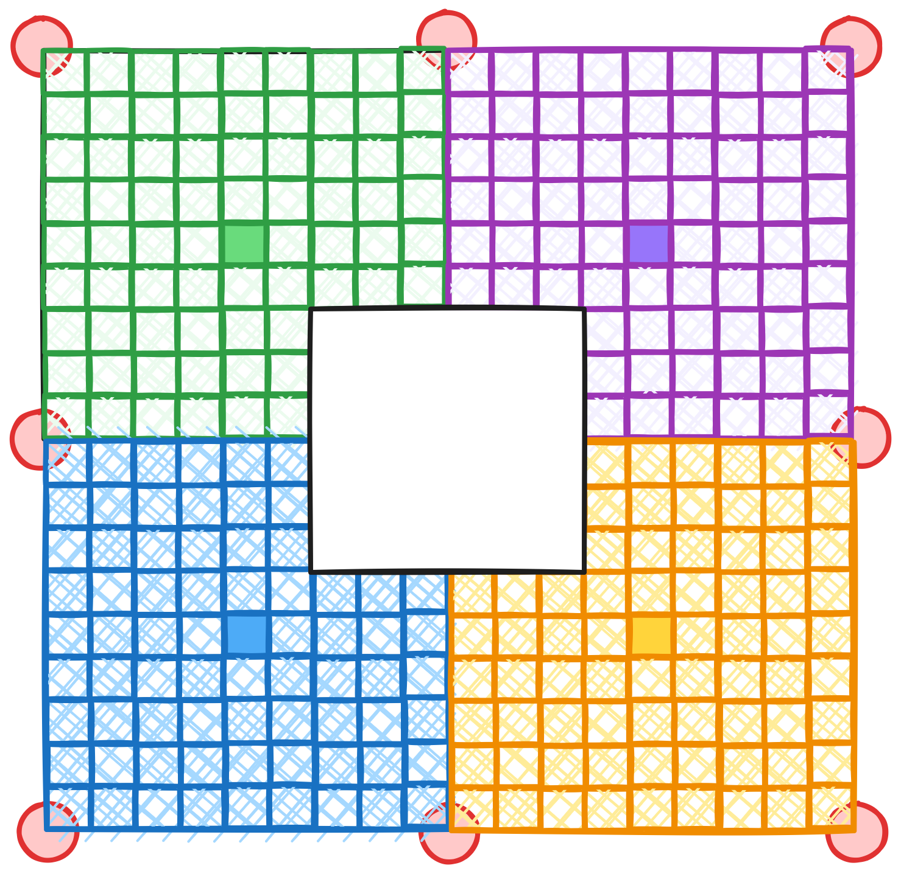
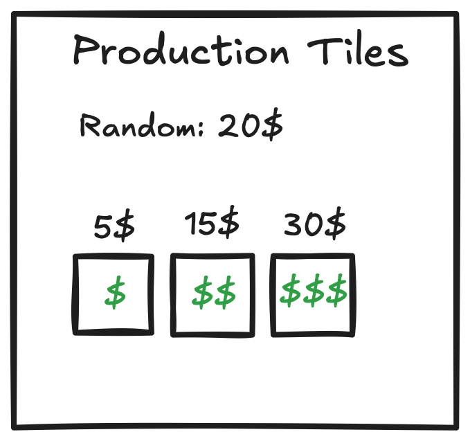
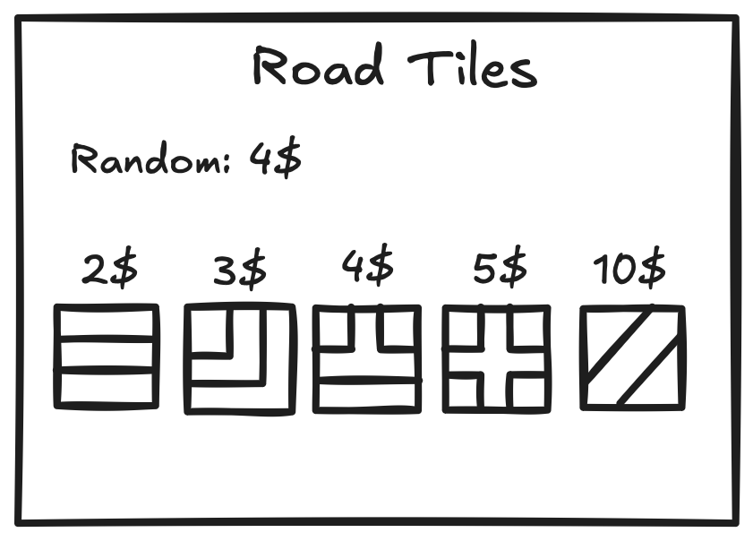
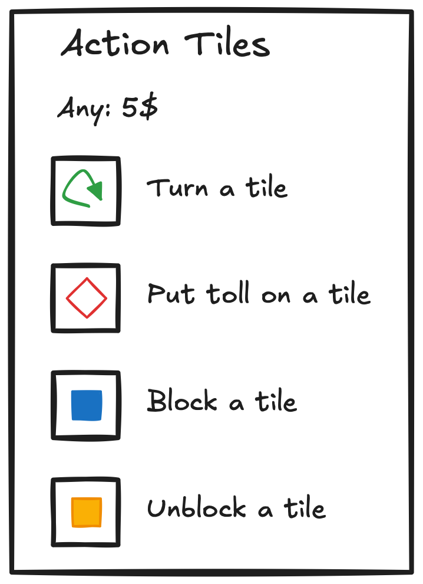
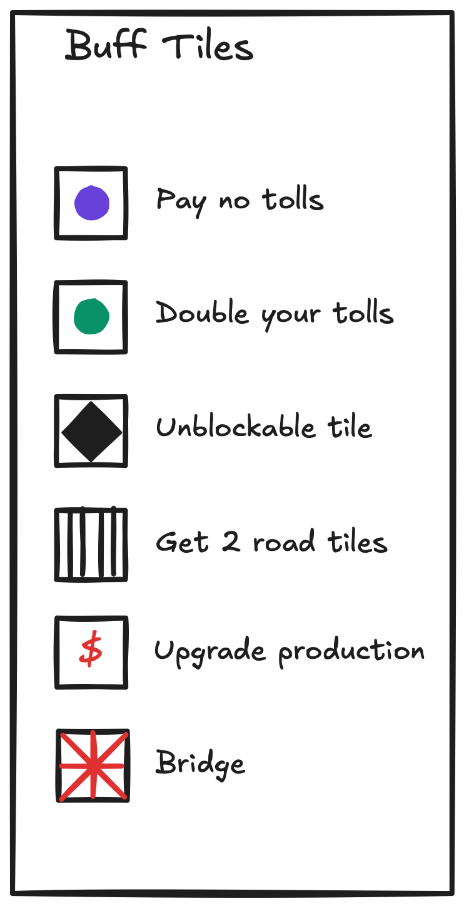

# Trades

Trades is a trade route optimization and city building game. The board is a 18x18 square board, with a 6x6 squares
neutral area in the middle, and is divided into 4 equal 9x9 regions allocated to each player. For more than 4 players, additional blocks are going to be added.

The game is divided into two phases, where the first phase is mostly route building, diplomacy and strategy design, and
the second part is the city building, as well as preventing other players from building their cities.

## Rounds

Each round consists of multiple turns for each player, where each player can take maximum 2 actions per turn. If a player passes their turn, they cannot take any action until the next round. The round ends when all players pass their turns. The players receive their gold production at the beginning of each round, and they can use their golds to buy tiles, or pay tolls.

At the end of each round, an *event* is drawn from the event deck. The event deck consists of 25 events, where the *switch to phase 2* event resides in 20-25th place.

## Gold Production

The players start with a base gold production of 6 golds per round and needs to buy and build production tiles for increasing their gold inputs. There are 3 production tiles;

1. 1 gold production tile: costs 5 golds
2. 2 gold production tile: costs 15 golds
3. 3 gold production tile: costs 30 golds

In the second phase of the game, gold production can be switched to a different source according to the position of the player. 

<?
    Kaynaklar neler? 
    Günün sonunda temel amaç ne? Oyunu kazanan nasıl kazanıyor?
>

At any point, a player receives half of their gold production at the beginning of their route, and the other half
at the end. If production is an odd number, the extra gold goes to the beginning. (7 becomes 4 + 3 instead of 3 + 4)

The players can only receive payment for production tiles they have "routes" to, where routes consist of contiguous
road tiles.

## Road Tiles

There are 4 rectangular road tiles. The rectangular roads can be used to connect 2, 2, 3, 4 tiles together.

Below is an illustration of the road tiles, and their costs.

1. Straight road: costs 2 golds   
2. L-shaped road: costs 3 golds   
3. T-shaped road: costs 4 golds   
4. Crossroad: costs 7 golds

<?
    Random alınacak tile neye göre belirlenecek? 
>

The players can also buy random road tiles for 4 golds. This is a risky move, as crossroads are
rare, and the player might end up overpaying for a straight or L-shaped road.

<!
    Düşündük ki bir oyuncu random tile aldığında nereye koyacağını belirtir ve bir zar atar. Attığı zar 1 gelirse straight, 2 gelirse L-shaped, 3 gelirse T-shaped ve 4 gelirse de Crossroad koyma hakkı kazanır. Lakin 5 veya 6 gelirse tekrar zar atılır. Tekrar zar atma işlemi 3 kez gerçekleştirirse yol bloke olur (Blocked Tile durumu). Oyuncu ekstra para harcayarak bunu bir sonraki tur kaldırabilir. 
>

Typically, building one route to a production tile might be insufficient, as the other players might block the route
with roadblocks, which cuts access to production. Such roadblocks are parts of action tiles.

## Action Tiles

There are 4 action tiles, they can only be bought for 5 golds.

1. Turn road: rotates a road tile 90 or 180 degrees
2. Roadblock: blocks a road tile
3. Unblock: unblocks a road tile
4. Toll: forces a player to pay 1 gold every time they pass through a road tile

## Buff Tiles

Buff tiles are stronger than action tiles, and they cannot be bought, but only earned.

1. Quite Steps: Player pays no tolls for 3 rounds
2. Greedy Inn: Player doubles their tolls for 3 rounds
3. Road Guardian: Player can mark a road tile as unblockable.
4. Bridge: A player can upgrade a road file by adding a new direction to it(up, down, left diagonal, right diagonal).
5. Banker: Player can upgrade a production tile.
6. Roadster: Player gets 2 random road tiles for free.

## Phase 1

As mentioned before, Trades is a two-phase game, where the first phase is mostly about route building, diplomacy, and
strategy design. The players start with a base gold production of 6 golds, buy and lay road and production tiles, and use the road tiles to connect their city centers to production tiles. Players can put roadblocks to prevent other players from accessing
their production tiles, and build toll onto their road infrastructures to tax other players.

After certain events, such as a player connecting their city center to a production tile, or a player buying a tile in the
neutral area, 8 buff tiles are randomly drawn from the deck. The first player looks at all cards, picks 2 of them, and gives
the remaining 6 to the next player. The next player picks 2 of them, and gives the remaining 4 to the next player, and so on.

After all players have their 2 cards, they put 1 of their cards to their corner of the board face down, and they put the second
card to the shared hub with one of their neighbors. Shared hubs are 9-10,0, 18,9-10, 9-10,18, and 0,9-10 coordinates on the board.

The cards in the shared hubs are {todo:X'd}.

Once any two players reach to one of the 4 center tiles, the game moves into the second phase. 

## Phase 2

Players can produce any source including other players' one in the neutral area. Additionally, any player reaching that source can produce the same source. 

<?
    Bir kaynağa birden fazla oyuncu ulaşırsa kaynak miktarı ulaşan oyuncu sayısına mı bölünür yoksa herkes tam kapasite üretim mi yapar?
>

The players need all resources to complete the game. Therefore, a trade is almost inevitable. The only way is to use neutral area production.

The players will upgrade their city centers 4 times. The first upgrade will require using only their own resources, the second will require using 2 different resources, the third will require using 3 different resources, and the last upgrade will require using all 4 resources.

The upgrades will require randomized compositions of resources, with a specific order according to the players' affinity. The nations are Romans that excel in Science, Vikings that excel as Warriors, Egyptians that excel in Agriculture, and Aztecs who are excellent Builders. The players will be assigned to one of these nations, and they will be able to produce resources according to their nations. The players will be able to trade resources with each other, but they will not be able to produce resources that are not in their affinity. The nations are as follows:

1. Romans: Crystal
2. Vikings: Steel
3. Egyptians: Food
4. Aztecs: Stone

